På grunn av COVID ble mye av undervisningen dette året holdt digitalt, det samme
gjaldt prisutdelingen. Hvem som satt i juryen og hvilke premier som ble delt ut
er gått i glemmeboken, det samme er navn på teammedlemmene.

## Vinnende team

### Team 13: Kutta

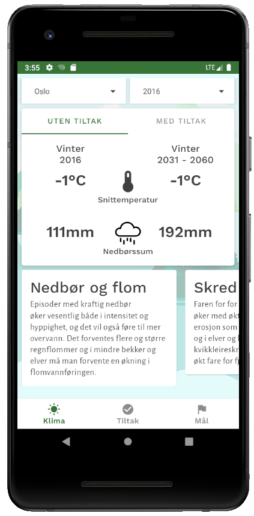 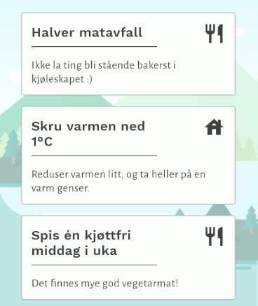

Prisen for mest samfunnsnyttig tjeneste gikk til appen **Kutta**,
beregnet på personer mellom 18 og 30 år som ønsker å redusere sitt personlige
klimaavtrykk. De hadde hentet inn algoritmer for beregning
av personlig klimaavtrykk og forslag til tiltak som kjøttfri middag, redusere
flyreiser o.l..

### Team 14: Fima Feng

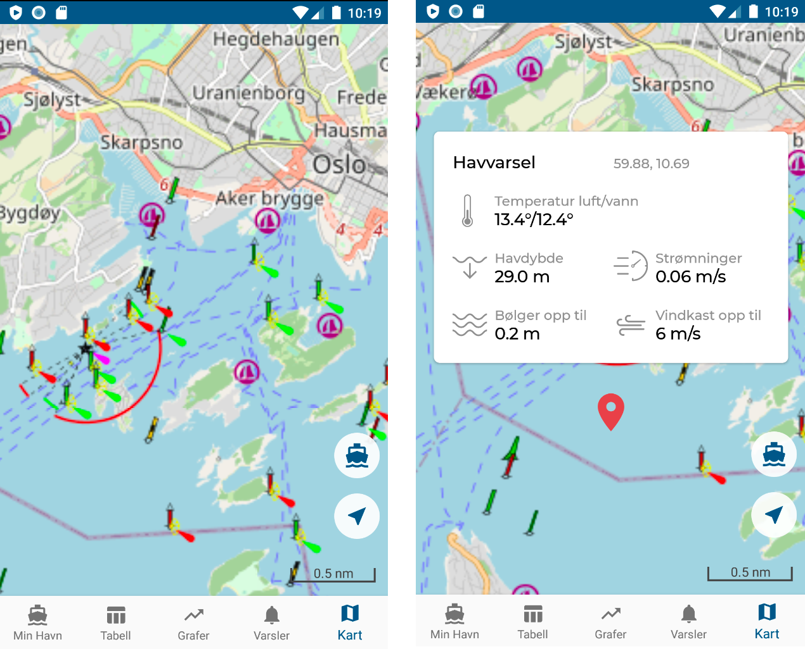

Prisen for mest nyttige app basert på METs tjenester gikk til appen **Fimafeng**.
Denne var beregnet for båteiere som primært kunne få varslinger dersom det
oppsto situasjoner hvor fortøyde fartøyer kunne komme til skade (sterk vind,
høyt tidevann m.m.). Den hadde også en god del funksjonalitet for navigasjon til
sjøs, deriblant vind- og strømforhold som kunne være et godt supplement til
navigasjonssystemer som har gode sjøkart men ofte mangler værinformasjon.

### Team 22: Kuling

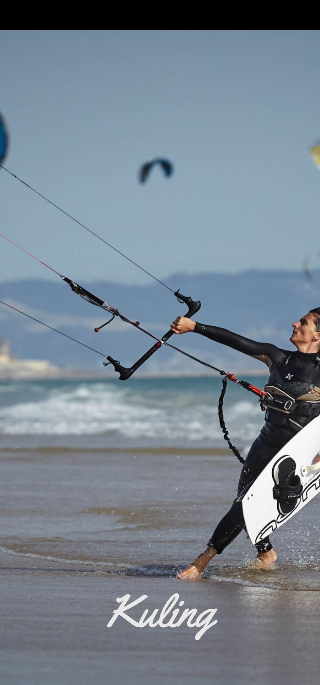 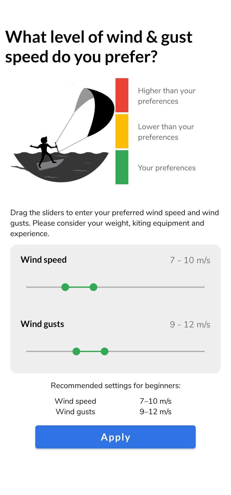 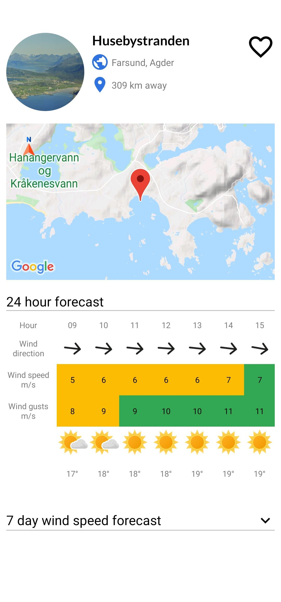 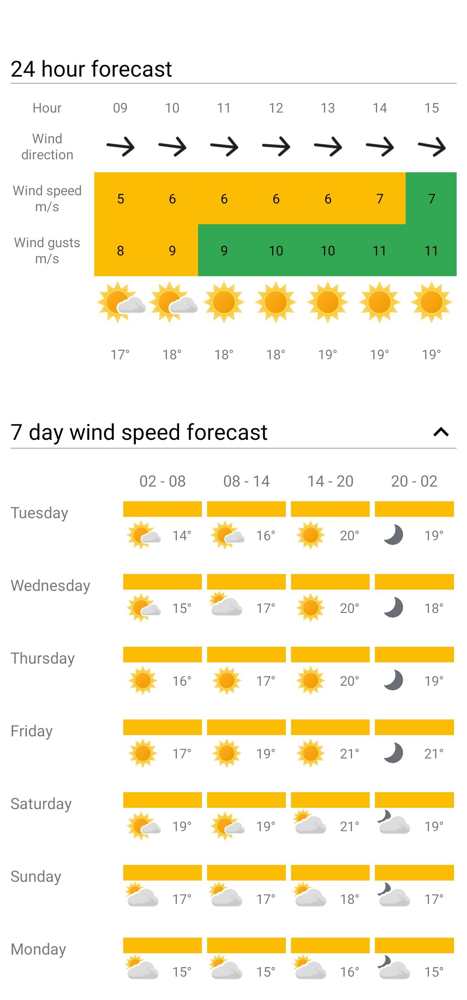

*Kuling* var en app beregnet på kitesurfere som ønsket å planlegge turer i
Oslofjorden ut fra vind- og strømforhold.

### Team 30: Eventur

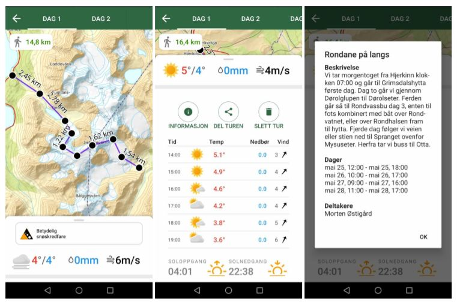

*Eventur* var en app hvor man kunne plotte turer i terrenget og få løpende
værvarsel for de forskjellige intervallene.

### Team 33: Sunride

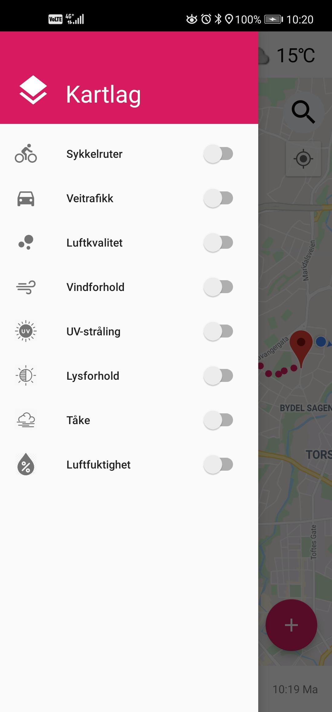 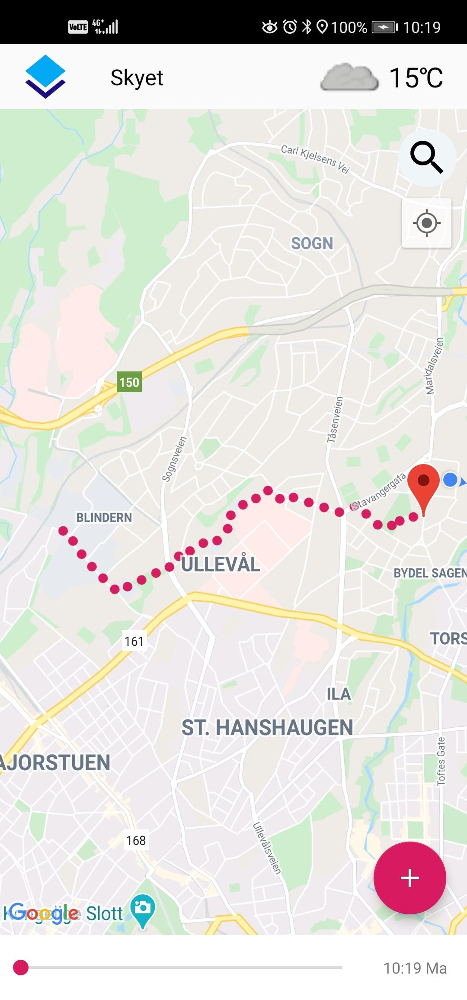 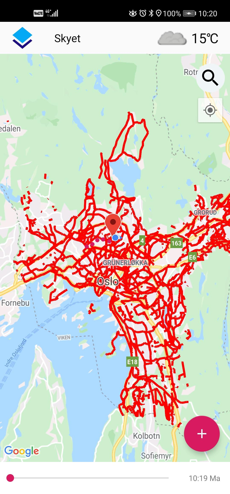

Dette var en app laget for planlegging av sykkelturer innen Oslo kommune, hvor
de også hadde hentet inn sykkelruter fra. I tillegg hadde de naturligvis også
værinformasjon for turen, muligens også luftkvalitet.

