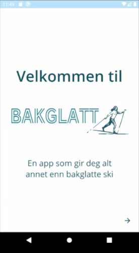
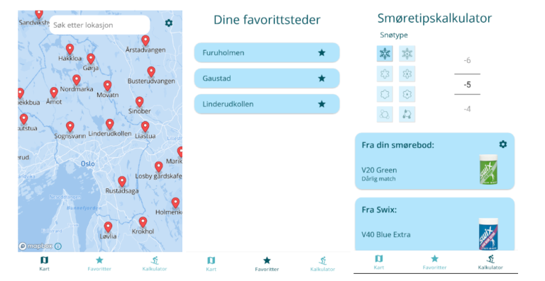

## MET-pris til smøre-app

En studentutviklet app som gir deg anbefalinger for passende skismøring vant
METs pris i årets kåring av beste utnyttelse av våre data i kurset IN2000.

For tredje år på rad har Meteorologisk institutt samarbeidet med Institutt for
informatikk (UiO) gjennom kurset IN2000 - Software Engineering med
prosjektarbeid. Våren 2021 tok 280 studenter fordelt på 48 grupper dette kurset.

### Spesiell pris fra MET til ett vinnerlag

Studentene ved kurset utvikler egne apper der de tar i bruk METs åpne data og
programmeringsgrensesnitt (API) som grunnlag. På slutten av kurset kårer
Institutt for informatikk fem vinnere for beste app.

Meteorologisk institutt kårer én vinner, som vi synes viser den beste bruken av
våre data. Den digitale prisseremonien fant sted torsdag 10. juni.

"Jeg er imponert over hva studentene får til i dette kurset", sier direktør Roar Skålin.
"Samarbeidet med Institutt for informatikk er viktig for oss, det gir oss også
nye idéer til hva våre data kan brukes til og hvordan API-et vårt fungerer."

Vinnerne av MET-prisen 2021 var studentene bak appen «Bakglatt»: Haakon Ottem
Svanes, Theodor Harket, Erik Alexander Berg-Johnsen, Anna Elise Dæhlen, Ask
Attilla Dagestad Strande og Sigurd Ormseth Årøen.

For å lage denne appen har studentene brukt historiske data sammen med
værvarsel, for å si hva som er optimal skismøring på et bestemt sted, basert på
været den siste uken og på værvarselet fremover i tid.

Brukeren kan legge inn den skismøringen han eller hun selv eier og få smøretips
tilpasset sin egen «smørebod».

### Idéen ble født på skitur

"Jeg hadde lenge gledet meg til faget hvor vi skulle utvikle en app, siden mange
fra de eldre kullene har snakket varmt om det", forteller student på vinnerlaget
Sigurd Ormseth Årøen.

Sigurd forteller at han derfor allerede en god stund før han tok kurset tenkte
på en idé som ville skille seg litt ut fra de andre.

"I vinter oppdaget jeg hvor moro det er å gå på ski, men samtidig oppdaget jeg
hvor vanskelig det kan være å vite hva slags skismøring man skal velge",
forteller han.
"Da dukket idéen opp om å lage en app som skulle hjelpe til med å finne optimal
skismøring for brukeren. Alle i gruppen ble enige om å gå videre med idéen, og
sammen forvandlet vi idéen til appen vår, som vi kalte Bakglatt."

### Digitalt og kreativt samarbeid

Medstudent Anna Elise Dæhlen forteller at prosjektarbeidet har vært veldig
lærerikt. Studentene som skulle jobbe sammen i arbeidsgrupper kjente hverandre
ikke på forhånd.

"Det utfordret oss enda mer når det kom til å bli kjent og etablere et godt
samarbeid", forteller Anna Elise.

Hele samarbeidet har foregått digitalt og studentene har arbeidet sammen over
Zoom i flere måneder.

"I en tid hvor mange studenter opplever at det er krevende å studere har vi vært
veldig heldige med å kunne få arbeide så kreativt og fritt i et helt semester",
sier Anna Elise.
"Det at vi fikk lov til å komme med vår egen idé til hvordan vi ønsket å benytte
MET sin data i applikasjonen vår var veldig kult! Vi er stolte og fornøyde med
resultatet."

Hun forteller at de hentet inspirasjon fra lignende applikasjoner på markedet,
men at de videreutviklet flere funksjoner som de ble veldig fornøyde med.

"Prosjektet har vært svært engasjerende og vi har brukt mye tid på arbeidet
gjennom hele semesteret. Nå gleder vi oss til en velfortjent sommerferie og
synes det er ekstra stas å kunne ta ferie som vinnere av MET-prisen!"

De tre hovedskjermene i appen «Bakglatt».
Fra venstre mot høyre: kart, favorittsteder og smøretipskalkulator.

### Stor bredde i appene studentene lager

Studentene som tar kurset kan velge mellom flere idéer til apper, som for
eksempel badetemperaturer, farevarsler, flyscanner — eller de kan finne på noe
helt på egen hånd. Institutt for informatikk deler også ut fem priser til
utvalgte apper.

"Samarbeidet med MET og arbeidet med case og mulige værapper bidrar i stor grad
til at dette kurset er en suksess, sier førstelektor ved Institutt for
informatikk og foreleser i IN2000", Yngve Lindsjørn.

Alle vinnerne fikk et gavekort fra Institutt for informatikk i premie. I tillegg
får MET-vinnerne rekvisitter fra MET og Yr: termos, handlenett og powerbank.

## Vinnerne av Institutt for informatikk sine priser

Vinnerne av IFI-prisene var studenter bak følgende apper:

- Njord: Drivbanesimulering for søk og redning
- Stjerneklart: Forhold for stjernekikking der du er
- Spontan: Reisetips basert på pris- og værpreferanser
- JaktApp: Jaktforhold og lokkelyder
- Badetemperaturer i Oslo: Oversikt over badetemperaturer i nærheten av deg

