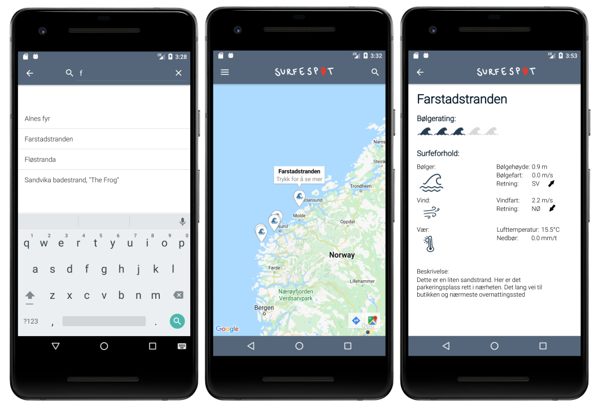
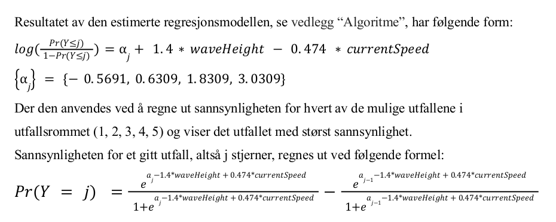

Prisutdelingen fant sted i baren på IFI 8. juni, med kake fra MET og pizza fra
UiO. Vinnerne ble valgt ut av IFI med input fra MET, og
fikk alle et gavekort på 1000 kr som kunne brukes til en felles middag e.l.

## Priser fra IFI

Siden fordelingen på caser var såpass ujevnt fordelt valgte kursledelsen å
droppe å gi priser for hvert case til fordel for 5 ad hoc kategorier de fant på
under innspurten av kurset.

Følgende vinnere ble kåret:

1. **Kreativ løsning**: Team 1 – *Kleddy* (Åpen case) 
    En app laget for (og testet på) barnehagebarn for å lære å kle seg riktig. Hadde også laget en egen promo-sang!
2. **Gründerprisen**: Team 7 – *Frolf*  (Åpen case) 
    En app for utøvere av frisbeegolf, som hevdes var bedre enn alle andre apper på Google Play Store
3. **Feteste algoritme**: Team 26: *Surfespot* (Åpen case) 
    Hadde brukt regresjonsanalyse av Oceanforecast for å lage en modell som fant de beste surfestedene i Norge
4. **Visuelt slående**: Team 32: *Solbrent* (Åpen case) 
    Ett av to team som hadde laget solkremvalg-apper basert på UV-varsel i Locationforecast
5. **Beste app**: Team 6: *Gladlaks* (Miljøforhold i oppdrettsanlegg) 
    Meget gjennomført app for vetrinærer i oppdrettsbransjen, med mye funksjonalitet og grundig research

## MET-prisen

I tillegg til ovenstående delte vår direktør ut MET-prisen for mest kreativ bruk
av våre frie data. Her vant igjen appen *Surfespot* av Team 26, som besto av
Alfred Løvgren, Andrea Corneliussen Austeng, Anne Lise Holst, Emilie Frivåg
Valskar, Magnus Gretton og Venus Livary.

Vi har fått tilgang til rapporten deres som beskriver modellen de har laget i
detalj, her er den essensielle formelen som de har kommet frem til ved å
sammenlikne prognoser med anerkjente surfesteder:

