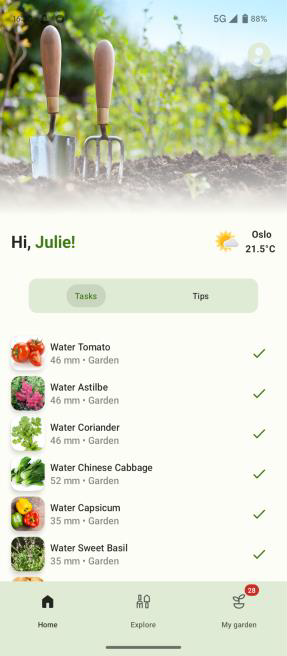
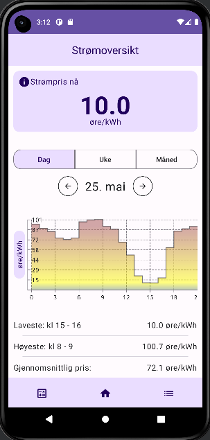
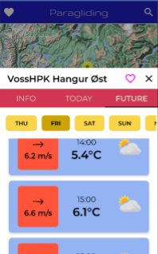
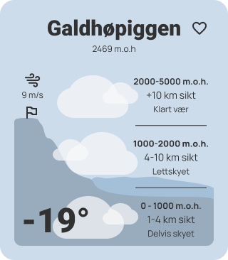

Dette året foregikk prisutdelingen for første gang i METs lokaler, nærmere
bestemt i Tallhall 14. juni hvor over 100 studenter møtte opp og spiste kake
mens 11 team viste fram hva de hadde laget. Presentasjonene ble streamet som
Kaffeinfo for hele instituttet samt inviterte samarbeidspartnere som
Havforskningsinstituttet.

Det var store tekniske problemer både med laptopen som
skulle kjøre appene og AV-utstyret i Tallhall som delvis hadde sluttet å virke,
men ved hjelp av iherdig innsats gikk det likevel å få kjørt både presentasjoner
og prisutdeling i løpet av de avsatte to timene (stor takk til producer Magne
Velle som fikk ordnet ny prosjektor og videostreaming).

Av de 11 teamene ble det plukket ut 4 team som alle fikk gavekort på 1000 kr. I
tillegg delte direktøren ut MET-prisen for beste benyttelse av våre data til
Team 10, som fikk diplomer og Yr-swag. Juryen besto i år av Louise Oram (Frost),
Martin Sætra (Havvarsel) og Roar Skålin (direktør). Ingen fra IFI var i år
involvert i bedømmingen, men bekostet tre av gavekortene.

## MET-prisen

Prisen for mest innovativ bruk av meteorologiske data gikk til Julie Haukås ,
Arian Sharifi, Lars Aasheim, Jørgen Osberg, Edward Kang og Jasuhan Yoganathan.
Juryen begrunnet valget slik:

**Team 10: Garden Genius** (hagestellapp) Mye funksjonalitet, udekket behov i
markedet, stort potensiale. Nær komplett løsning som kan lanseres. Kombinerer
klimadata med andre data på en innovativ måte.

## På oppløpsiden

**Team 2: Sikt** (fjellturplanlegger) Godt design, mye funksjonalitet som vi
ikke har sett i andre apper som presenterer sikt fra gitte punkter, og som
absolutt er av interesse for toppturentusiaster.

**Team 9: ThrillCast** (paraglider app) Potensiell høy nytteverdi for en
nisjegruppe hvor sikkerhet er viktig. Setter sammen informasjon som gjør det
enklere for brukeren å få et helhetsbilde, og dermed øker sikkerheten
(informasjonen er i dag spredt på flere plattformer).

**Team 12: Elektra** (strømpriskalkulator) Den av strømpris appene som hadde det
mest nyskapende innholdet. Flere andre var også gode, men innholdet var nærmere
det som strømleverandørene har i sine apper. Liten praktisk nytte pga for stor
usikkerhet, men gjennomført anvendelse av AI/ML (TensorFlow) som er svært
relevant for videre forskning innen feltet.

## Andre nominerte

- Team 3: Windcatcher
- Team 2: Sikt
- Team 21: Spotterplassen
- Team 25: AquaMap
- Team 26: Strømpris
- Team 27: Watt Wizard
- Team 28: DroneHjerte
- Team 31: Shoot for the Sun
