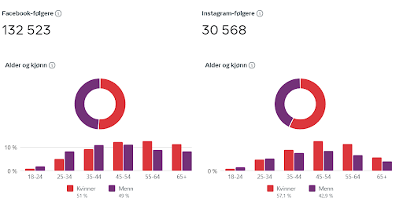

Lag en værapp som appellerer til barn og ungdom!

## Bakgrunn

MET har gjennom tidene hatt en svært bra dekningsgrad hos det norske publikum,
etter tur via medier som radio, TV og nå Yr på web og mobilapper. Dog har man
identifisert at MET har vanskelig for å nå ut til brukere under 25
år som verken ser lineær-TV, hører på DAB-radio eller bruker Yr. Vi trenger å
vite hvordan man skal kunne nå ut disse med våre varsler, da spesielt våre
farevarsler som ikke er like lett tilgjengelige via internasjonale tjenester
som Apple Weather, AccuWeather eller Windy.

Teamene må kartlegge behov og ønsker i brukergruppen, som er barn og ungdom i
alderen 9-25 år som ikke bruker Yr. Finn ut hvorfor de bruker noe annet enn Yr,
og hva som skal til for at de vil ta i bruk noe som passer bedre til deres
behov. Lag så en app som oppfyller disse kravene best mulig.

Dette er delvis knyttet opp mot WMOs prosjekt [Early Warnings for
All](https://public.wmo.int/en/earlywarningsforall), som har som ambisjon at
alle skal kunne varsles om naturfarer som kan true liv og verdier.

## Obligatoriske datakilder

- [MetAlerts](https://api.met.no/weatherapi/metalerts/2.0/documentation) 2.0 beta, i XML- (RSS+CAP) eller JSON-format (begrunn valget)
- [Locationforcast](https://api.met.no/weatherapi/locationforecast/2.0/documentation) 2.0, i XML- (classic) eller JSON-format (begrunn valget)

## Andre nyttige datakilder

- Nowcast [API](/intro) - radarvarsel om nedbør
- Textforecast [API](/intro) - tekstvarsler for kyst og fiskebanker
- Sunrise [API](/intro) - ferdsel i mørke krever ekstra forhåndsregler
- [AirQualityForecast](https://api.met.no/weatherapi/airqualityforecast/0.1/documentation) - prognoser for luftkvalitet
- [Frost](/frost/) - historiske observasjoner og klima
- [Farevarsler fra NVE](https://api.nve.no/doc/) - flom, jordskred, snøskred, kart o.l. (både XML og JSON)
- [NILU API](https://api.nilu.no/) - luftkvalitetsmålinger i større byer
