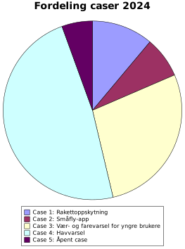

## Kursoversikt

- [Emneside for kurset](https://www.uio.no/studier/emner/matnat/ifi/IN2000/)
- [Semesterside for 2024](https://www.uio.no/studier/emner/matnat/ifi/IN2000/v24/)
- [Timeplan](https://www.uio.no/studier/emner/matnat/ifi/IN2000/v24/timeplan/index.html)

## Casebeskrivelser

- [Case 1. Rakettoppskytning](./1-rakett)
- [Case 2. Småfly-app](./2-pilot)
- [Case 3. Vær- og farevarsel for yngre brukere](./3-yngre)
- [Case 4. Havvarsel](./4-havvarsel)
- [Case 5. Åpent case – EDR](./5-opencase)

### Kort oversikt over obligatoriske APIer

|Tjeneste|Case 1|Case 2|Case 3|Case 4|Case 5|
|:-------|:----:|:----:|:----:|:----:|:----:|
|Locationforecast|x| |x|x‡| |
|MetAlerts       | | |x|x| |
|IsobaricGRIB    |x|x†| | | |
|EDR             | | | | |x|

- † eller THREDDS
- ‡ eller annet passende værvarsel

## Ekstrajobb?

God på Python og lyst på jobb i klima/luftforurensingsavdelinen hos MET?
Vi trenger en programmerer som kan jobbe én dag i uken våren 2024 +
fulltid to mnd i sommer, med noe slingringsmonn. Se
[stillingsannonse](sommerjobb.pdf) for mer informasjon.
**Obs! Søknadsfrist 4. mars!**
