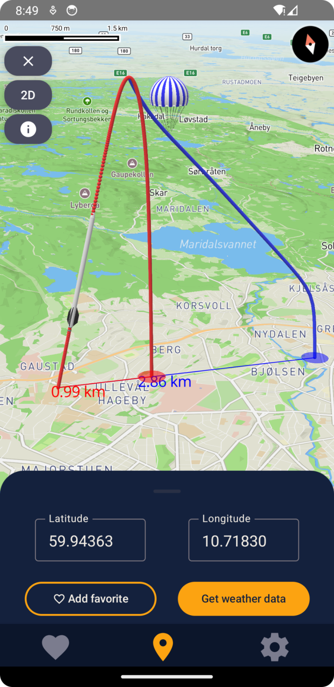

## Beregning og 3D-visualisering av ballistiske rakettbaner ble årets vinner

Studenter fra Institutt for informatikk viste stor bredde og kreativitet når de
etter snaue tre måneder presenterte resultatene fra prosjektet initiert av
Meteorologisk institutt.

Over 300 studenter fra Institutt for informatikk (IFI) ved Universitetet i Oslo
deltok i år på kurset “IN2000 – Software Engineering”. I nesten tre måneder har
de jobbet intenst med å få data fra Meteorologisk institutt til å ende opp som
en brukervennlig app i en aller annen form.

Torsdag 6. juni fikk studentene anledning til å vise fram det ferdige produktet
i Tallhall med kaker, presentasjoner og prisutdeling – før det endelige målet
står for tur: eksamen.

## Ti team, én vinner

*En værballong svever over et kart sammen med rød og blå streker fra ett område til et annet.*

– Jeg fikk æren av å velge ut 10 team av 55 som jeg syntes hadde gjort en
eksepsjonell innsats. Disse skulle presentere appen sin foran en utvalgt
MET-jury og medstudenter, sier Geir Aalberg, initiativtaker og koordinator fra
MET til Institutt for informatikk.

Valget sto mellom “BåtBuddy”, “Smacklip Surf”, “MetMate”, “VærSmart”, “InSight
“, “AirBorn”, “Havvarsel”, “Apex”, “Plane & Simple” og “FlyCast”.

Etter rundt to timer med grundige presentasjoner fra studentene trakk juryen seg
tilbake for å stemme fram en vinner. Team 25 med appen “Apex” var studentgruppa
som til slutt stakk av med seieren.

IT-direktør på MET, Anne-Cecilie Riiser hadde gleden av å dele ut
prisen til Nasteeho Abdullahi Elmi, Suad Raage Nuur, Magnus Kleven, Julian
Andres Haugen Rubilar og Håkon Bjørgen Refsvik. Jostein Røstad Jensen var ikke
til stede på prisutdelingen.

– Beregning og 3D-visualisering av ballistiske rakettbaner i MapBox (blant annet
bruk av differensialligninger) var det mest imponerende ved appen. Den skilte
seg ut fra de andre løsningene som ellers bare viste utskytningsforhold, utdyper
Geir Aalberg.

## Imponert

Kurset holdes hvert år og viser et stort spenn av kreative, innovative ideer fra
unge studenter som snart skal ut i det virkelige yrkeslivet.

– Vi lar oss virkelig imponere over nivået studentene har. Det er godt gjort å
lære seg alle verktøy og metoder, for ikke å snakke om å lage appen og skrive en
utførlig rapport.
