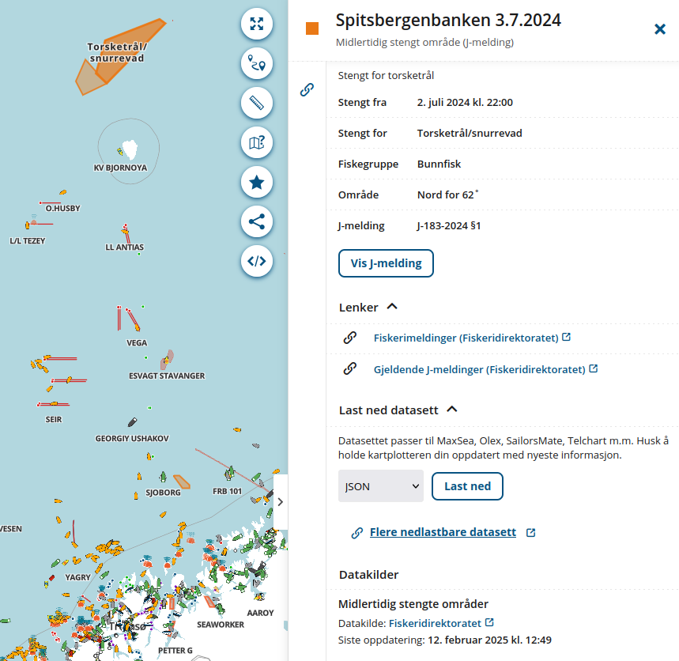

## Bakgrunn

Meteorologisk institutt ble stiftet i 1866, på bakgrunn av at alt for mange
sjøfolk forliste pga dårlig vær. Maritim værvarsling har deretter alltid vært en
av METs kjernevirksomheter.

IN2000 har hvert år pleid å ha et case relatert til havvarsel, og i år er intet
unntak. Dog har vi aldri tidligere hatt noen som har vist værtkart for havet.
Vi vet at det kjører minst 4000 fiskebåter rundt langs kysten som laster ned våre
værdata i [GRIB-format](/api/grib), men utenom det vet vi svært lite om hva de
brukes til. Siden fjorårets studenter med hell greide å bruke GRIB-filer utviklet
for Avinor for beregning av rakettoppskyting, ønsker vi i år å se om det er lite
greit å bruke de for maritime værkart.

## Funksjonelle krav

### Vise værinformasjon fra [Gribfiles](https://api.met.no/weatherapi/gribfiles/1.1/documentation) i kart ([liste](https://hjelp.yr.no/hc/en-us/articles/360009342993-GRIB-weather-data))

Nedbør og bølger er skalarverdier som kan vises med farger, mens vind og strøm
er vektorer hvor dere må tegne piler eller på andre måter angi både retning og styrke.
Dersom noen av verdiene overstiger en viss terskel (satt av bruker) skal dette
markeres i kartet så man kan unngå å ferdes i området.

Filene for Vestlandskysten er ganske store (opptil 4.5 MB), så hvis det blir
minneproblemer kan dere begrense kartet til enkelte deler av kysten.

### Vise [kuling- og farevarsler](https://api.met.no/weatherapi/metalerts/2.0/documentation) i kartet

Her kan med fordel GeoJSON-varianten brukes siden denne kan leses direkte av mange
kartklienter (f.eks. MapLibre).

## Annen valgfri funksjonalitet

### Navigasjon

Akkurat som veiene på land følger også skipstrafikken
[bestemte ruter](https://www.kystverket.no/sjovegen/farleder---vegen-til-sjos/)
hvor det er lite smart å legge til for å fiske. Disse bør derfor angis på kartet
så man kan holde god avstand.

Det er også mulig å plotte posisjonen til andre større fartøyer i sanntid.
Alle skip over 299 bruttotonn er pålagt å ha installert
[AIS](https://en.wikipedia.org/wiki/Automatic_identification_system)-transponder
som rapporterer posisjon til enhver tid. Denne brukes både for å unngå kollisjoner
og for å overvåke fiskeriflåten.

### Seiling

De fleste fiskebåter er naturligvis motoriserte, men det er også mulig å drive
sportsfiske fra seilbåt. For disse er vindretning og -styrke alfa og omega når
man skal legge kurs fra A til B. Mange greier å tolke disse ut fra vanlige
vindkart, men hvis man ønsker en litt annerledes oppgave kan det være interessant
å skulle forsøke å plotte raskeste vei ut fra gjeldende vind- og strømforhold.

### Finne fiskestimer

Det er mange forhold som påvirker muligheten for å finne fisk.
Fisk følger ofte strømmen, og leter etter mat i områder med sterk bevegelse.
Strømmen driver næringsrikt vann inn mot kysten, og dette tiltrekker seg fisk på
jakt etter mat. Dette drives delvis av havstrømmer, men også tidevannet som
hovedsaklig styres av månens bevegelser.

Lysforhold spiller også en rolle. Mange fiskearter er mest aktive rundt soloppgang
og solnedgang. Sterkt sollys kan gjøre fisken sky, mens overskyet vær og lett regn
kan tiltrekke fisk. Fiskeaktiviteten påvirker også i stor grad av vanntemperaturen.
Alt dette kan variere fra art til art.

Fisk samler seg gjerne i bestemte høyder over vrak. Ved å plotte inn slik i kartet
kan det bli lettere å finne steder med mye fisk.

## Datakilder

### Vær- og havvarsel (obligatoriske)

- [Gribfiles](https://api.met.no/weatherapi/gribfiles/1.1/documentation) - vind, nedbør, trykk, bølger og havstrøm
- [Kuling- og farevarsler](https://api.met.no/weatherapi/metalerts/2.0/documentation)

GRIB-filer produsert av NOAA for andre deler av verden kan lastes ned
[her](https://navigationlaptops.com/free-grib-marine-weather/).

### Andre kartlag

- [FiskInfo fra BarentsWatch](https://www.barentswatch.no/fiskinfo/) med datanedlasting
- [Kart i Fiskeridirektoratet](https://open-data-fiskeridirektoratet-fiskeridir.hub.arcgis.com/) med [demo](https://portal.fiskeridir.no/portal/apps/webappviewer/index.html?id=9aeb8c0425c3478ea021771a22d43476)
- [Kystverket WMS](https://kartkatalog.geonorge.no/metadata/kystverket/kystverkets-wms/768a3ca6-0655-45d5-8cd5-76bd7e0e59d2)

####  Hovedled og Biled

- [Farledsdatasettet](https://data.kystverket.no/dataset/8ff1538a-a93c-4391-8d6f-3555fc37819c)

### Observasjoner

#### AIS (sjøtrafikk i sanntid)

- Kystverket:
    - [AIS-data](https://www.kystverket.no/navigasjonstjenester/ais/tilgang-pa-ais-data/)
    - [WebSocket stream](https://www.kystverket.no/navigasjonstjenester/ais/tilgang-pa-ais-data/)
    - [Kartdemo](https://nais.kystverket.no/)
- BarentsWatch:
    - [AIS-data](https://developer.barentswatch.no/docs/category/ais/)
    - [OpenAPI](https://live.ais.barentswatch.no/index.html)

Her er eksempel på hvordan lytte på en AIS-stream under Linux:

    $ nc 153.44.253.27 5631|gpsdecode
    {"class":"AIS","device":"stdin","type":5,"repeat":0,"mmsi":258027890,"scaled":true,
    "imo":0,"ais_version":2,"callsign":"LH5130","shipname":"ASTOEINGEN","shiptype":79,
    "shiptype_text":"Cargo - No additional information","to_bow":5,"to_stern":10,
    "to_port":5,"to_starboard":5,"epfd":0,"epfd_text":"Undefined","eta":"05-28T24:60Z",
    "draught":3.0,"destination":"FISHFARMS","dte":0}

#### Vær- og sjødata

- [Frost](https://frost.met.no/index.html) - data fra målestasjoner rundt om i Norge (også historiske)
- [Havvarsel API](https://api.havvarsel.no/apis/duapi/havvarsel/v2/swagger-ui.html)
- [OceanForecast](https://api.met.no/weatherapi/oceanforecast/2.0/documentation) - punktbasert prognose for sjø og hav
- [Tidalwater](https://api.met.no/weatherapi/tidalwater/1.1/documentation) - tidevannstabeller for havner

### Andre

- [Sunrise](https://api.met.no/weatherapi/sunrise/3.0/documentation) - kalkulator for sol- og månebevegelser
- [Kystverkets datasett](https://data.kystverket.no/dataset/)
- [Åpne data via BarentsWatch](https://www.barentswatch.no/artikler/apnedata/) - API

## Eksempler til etterfølgelse og inspirasjon

- [Kystvær](https://www.kystverket.no/nyheter/2024/kystvar-varsensor-malinger-for-sjofarende/) - Værsensor-målinger for sjøfarende (data fra Frost)
- [OLEX](https://olex.no/products.html) - kommersiell leverandør av kartplottere
- [Skipper](https://github.com/norbert259/Skipper) - Båtførerapp med GRIB-nedlasting i Kotlin for Android *(merk: GPL!)*

