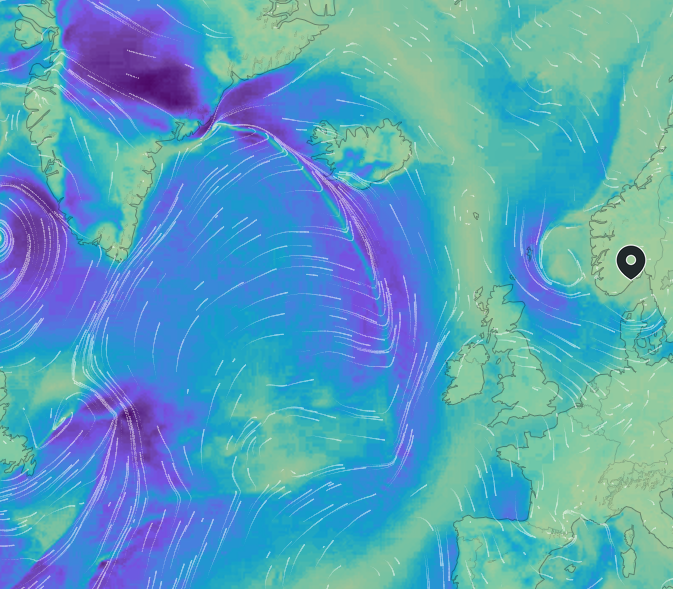

## Bakgrunn

For et par år siden lanserte vi nye værkart på Yr, som blant annet inkluderte
animerte vindkart basert på algoritmer utviklet for visualisering av data fra
partikkelakselerator. De nye kartene, som erstatter vår gamle WMS-karttjeneste
er utviklet etter spesifikasjon fra NRK og bruker Mapbox-protokollen.

I motsetning til andre karttjenester er de dog ikke laget for å plottes direkte
på kartet, men i stedet behandles som rådata som må prosesseres i klienten for
optimal visning. For eksempel har de ikke transparens, og vi bruker rød- og
grønnkomponenten i bildet for å angi hhv x- og y-komponenten av vindvektorer.
For optimal ytelse bør man bruke en GPU til å prosessere karttilene om til
bilder som kan vises på skjerm, enten via en backend med bruk av OpenGL, eller
vha WebGL direkte i klienten.

## Funksjonelle krav

Det anbefales å implementere dette i Android vha Javascript/WebGL i WebView.

Må kunne:

- legge tiles for temperatur og nedbør på kart
- lage transparens for data under gitt terskelverdi (fx regn)

Bør kunne:

- justere fargepalett

For spesielt interesserte:

- vise vind og strøm (med piler eller animasjon)
- kombinere med andre datakilder, fx turplanlegger fra [EnTur](https://data.entur.no/)
- sette opp en backend som rendrer ferdige karttiles som kan brukes direkte i klienten

## Datakilder

- <https://beta.yr-maps.met.no/> - kart-API med dokumentasjon **(obligatorisk)**

Kartilene bruker WebMercator-projeksjon, som er default i de fleste kartklienter.

## Ressurser

### Yr-maps

- [Dokumentasjon fra NRK](https://nrkno.github.io/yr-map-docs/) på tile rendering med [kildekode](https://github.com/nrkno/yr-map-docs)
- [TileConvert](https://github.com/metno/tileconvert) - Go-kode for proxy server for produksjon av tiles som kan leses direkte inn i kartbibliotek
- [Yr-maps demo client](https://client.yr-maps.met.no/)

### WebGL
- [WebGL Fundamentals](https://webglfundamentals.org/)
- [WebGL i Kotlin eksempel](https://github.com/me9hanics/Computer_graphics-WebGL-Kotlin)

### WebView in Android
- [Generelt om Webview](https://developer.android.com/develop/ui/views/layout/webapps/webview)
- [Selve komponenten](https://developer.android.com/reference/android/webkit/WebView)

## Spørsmål?

Kontakt <a href="mailto:yr-maps@met.no">yr-maps@met.no</a> for tekniske spørsmål
angående kartene (men *ikke* om Android/Kotlin, der må dere spørre gruppelærer).
