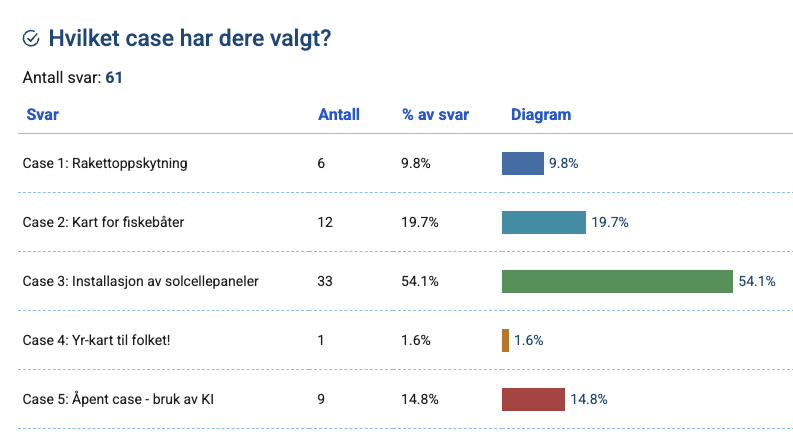

## Kursoversikt

- [Emneside for kurset](https://www.uio.no/studier/emner/matnat/ifi/IN2000/)
- [Semesterside for 2025](https://www.uio.no/studier/emner/matnat/ifi/IN2000/v25/)
- [Timeplan](https://www.uio.no/studier/emner/matnat/ifi/IN2000/v25/timeplan/index.html)

## Casebeskrivelser

- [Case 1. Rakettoppskyting](./1-rakett)
- [Case 2. Kart for fiskebåter](./2-fiskeri)
- [Case 3. Installasjon av solcellepaneler](3-solceller)
- [Case 4. Yr-kart til allmenheten](./4-yr-kart)
- [Case 5. Åpent case - bruk av KI](./5-open-ai)

### Fordeling

## Prisutdeling

Prisutdelingen finner sted hos Meteorologisk institutt **tirsdag 17. JUNI kl 14-16.**
Det blir servering av kaker og kaffe, men er begrenset med plass så de nominerte teamene
har fortrinnsrett. Alle kan imidlertid følge prisutdelingen på Zoom:

<https://met-no.zoom.us/j/66487823868>

### Nominerte team

- Team 1: Tryggve (case 5)
- Team 5: Solrik (case 3)
- Team 7: Shaka (case 5)
- Team 17: Fiskefinner (case 5)
- Team 21: SOAR (case 1)
- Team 28: VAFF (case 4)
- Team 34: Solvei (case 3)
- Team 44: Fiskebåt app (case 2)
- Team 46: Fiskeklar (case 2)
- Team 47: Rocketboy (case 1)
- Team 54: SunSaver (case 3)
