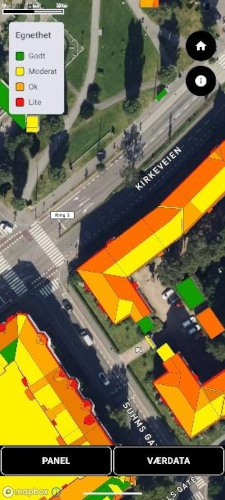
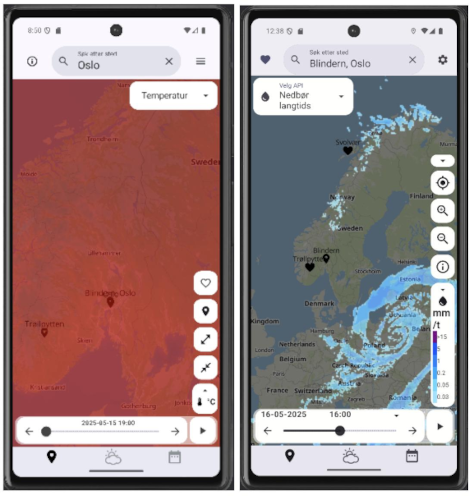

## Prisutdeling

Prisutdelingen fant sted hos Meteorologisk institutt tirsdag 17. juni, med
servering av kaker og kaffe. Dessverre ble det lagt ut feil Zoom-link, så
det var ikke mulig å følge prisutdelingen digitalt, noe vi beklager.

### Nominerte team

- Team 1: Tryggve (case 5)
- Team 5: Solrik (case 3)
- Team 7: Shaka (case 5)
- Team 17: Fiskefinner (case 5)
- Team 21: SOAR (case 1)
- Team 28: VAFF (case 4)
- Team 34: Solvei (case 3)
- Team 44: Fiskebåt app (case 2)
- Team 46: Fiskeklar (case 2)
- Team 47: Rocketboy (case 1)
- Team 54: SunSaver (case 3)

### Vinnere

Vinnerne av MET-prisen ble Team 21 med appen **SOAR**, som beregnet ballistiske
rakettbaner på kart i 3-D (ikke ulikt vinnerne fra året før). Teamet besto av
Lars Tynes, Insaaf Abdilahi Mahamuud, Jakob Loe, Malaika Lalen Azam, Torbjørn
Hamre og Neha Zahid.

På hhv andre og tredje plass kom Team 5 (Solrik) og Team 28 (VAFF). Førstnevnte
hadde importert data om alle takflater i Norge og viste disse med fargeskala
hvor egnet de var for solceller. Det andre teamet hadde laget en backend som
konverterte kartflisene fra beta.yr-maps til ordentlige bilder med transparens.

Imponerende innsats av alle nominerte team!
