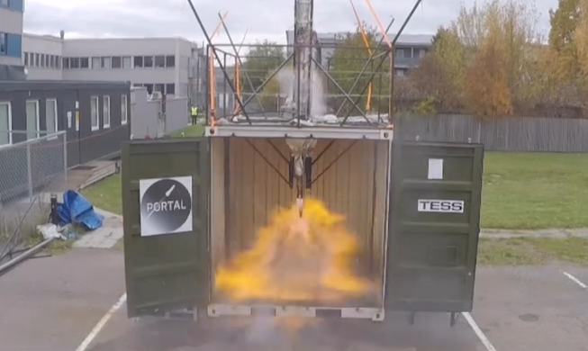

## Bakgrunn

De to siste årene har MET og rakettbyggegruppen
[PortalSpace](https://www.portalspace.no/) på UiO samarbeidet om et case for
rakettoppskyting, og begge årene har det vært en av disse appene som har vunnet
MET-prisen. For de som ønsker å oppnå denne æren er altså oddsene størst hvis
man velger dette caset.

Ved en rakettoppskytning er det mange faktorer som skal stemme, og en faktor
som man ikke kan kontrollere er været. Derfor trenger man kontinuerlig oppdaterte
data for hvordan været kommet til å utvikle seg gjennom oppskytningsvinduet.

## Funksjonelle krav

Nytt av året er at dere skal bruke en ny tjeneste fra MET kalt **Interpol**.
Dette er et produkt som leverer vertikalprofiler (værdata i høyden over et gitt punkt)
på JSON-format.
Det er bl.a. utviklet for Andøya Spaceport, og inneholder data for ca 200 faste
lokasjoner i Europa.

For PortalSpace er dog Interpol vanligvis ikke til særlig nytte, siden de trenger
å kunne skyte ut fra et vilkårlig sted i Norge. Til dette har vi tidligere år
brukt tjenesten **Isobarcgrib** på api.met.no, som egentlig er utviklet for Avinor
for flytrafikk. Poenget med årets case er å sammenlikne data fra Interpol og Isobarcgrib
for samme posisjon, for å se hvor godt dataene stemmer overens.

### Finne passende tidsvindu for utskytning

Mens de foregående datakildene sier mye om forholdene i høyden, sier de ingenting
om forholdene på bakken. Siden raketten påvirkes mest av vind når den har lavest
hastighet er derfor vindstyrken ved utskytningsrampen av kritisk betydning.
I tillegg tåler elektronikk vann og is dårlig, så det er viktig å unngå nedbør
og høy luftfuktighet. Til sist ønsker man fri sikt av sikkerhetsmessige hensyn,
derfor bør det også være skyfritt ved utskytningstidspunktet. Lyn er heller ikke
særlig populære, men kommer sjelden fra skyfri himmel.

### Beregne og visualisere bane på kart

Etter å ha valgt ønsket tid og sted for oppskyting, skal appen beregne banen til
raketten og vise sannsynlig landingssted (fortrinnsvis både med og uten bremsefallskjerm).
Banen skal vises på kartet, gjerne i 3-D (slik de forrige prisvinnerne fikk til).

For detaljerte krav fra Portalspace, se fjorårets [kravspesifikasjon](/2025/portalspace).

## Datakilder

### Interpol (obligatorisk)

Denne tjenesten har et [EDR-grensesnitt](/edr/), hvor hver modellkjøring
legges ut som en egen instans. Det kjøres nye simuleringer hver tredje time,
og man kan finne kjøringer for tre dager tilbake. Det er normalt ingen grunn
til å bruke annet enn den nyeste kjøringen (siste instans i listen).

- <https://interpol.met.no/collections/meps-det-vertical/instances> - liste over modellkjøringer
- <https://interpol.met.no/collections/meps-det-vdiv/instances/2026-02-24T06:00Z/locations> - liste over lokasjoner (endre dato)
- <https://interpol.met.no/collections/meps-det-vdiv/instances/2026-02-24T06:00Z/locations/andoya> - data for Andøya (endre dato)

### IsobaricGRIB

- [Isobarcgrib API](/api/grib) (GRIB2 for southern_norway)

Her kan man laste ned filer i GRIB2-format, som gir informasjon om vind og temperatur
på forskjellige nivåer i atmosføren. Merk at nivåene angis som trykkflater i hPa,
og at vind angis som vektor med x- og y-komponent (u og v).

For mer informasjon, se [dokumentasjon for GRIB-formatet](/api/grib).

### Locationforecast

- [Locationforecast](/intro) på api.met.no for bakkedata

### Frost

- [Frost](https://frost-rc.met.no/docs/apirefbasic#/Lightning) - lynobservasjoner (sanntid og historiske)

## Kontaktinformasjon / andre ressurser

- [Portal Space nettside](https://www.portalspace.no/)
- [Instagram feed](https://www.piokok.com/profile/portalspaceno/)
- Håkon Offernes, Chief Electrical Officer, <haakono@portalspace.no>, +47 466 14 464
