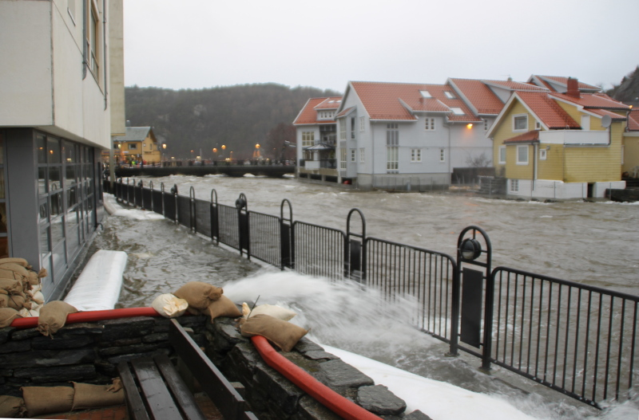

<figure>
    
    <figcaption>Ekstremværet Synne desember 2015 (© Semb Hadland/Eigersund kommune)</figcaption>
</figure>

## Bakgrunn

Varmere klima fører til mer fuktighet i luften

## Funksjonelle krav

Appen skal formidle nyttig informasjon om en eller flere naturhendelser av typen:

- flom i vassdrag
- snøskred
- styrtregn
- kraftig vind
- bølger og springflo

Det er valgfritt om dere ønsker å dekke alle typer hendelser, eller velge noen hvor dere går mer i dybden.

Målgrupper kan være:

- boligbyggere som vil unngå flom- og rasutsatte tomter
- boligeiere som vil sjekke risiko for flom/ras og få råd om tiltak (drenering, fjellsikring, beplantning)
- kommunale etater som ønsker mer informasjon enn hva som finnes på varsom.no
- bønder som risikerer tap i avling pga tørke eller mye nedbør

Appen bør vise på kart områder som er spesielt utsatt for

## Datakilder

### Klimadata

- [Frost v1](https://frost-rc.met.no/) - ny versjon i beta, offisiell lansering forventet over sommeren
- [EUMETNET Climate Observations](https://api.meteogate.eu/eu-eumetnet-climate-observations/v1) - aggregerte europeiske klimadata

### Karttjenester

- [NVEs kartkatalog](https://kartkatalog.nve.no/#wms) . har bl.a. flom- og skredkart i WMS-format
