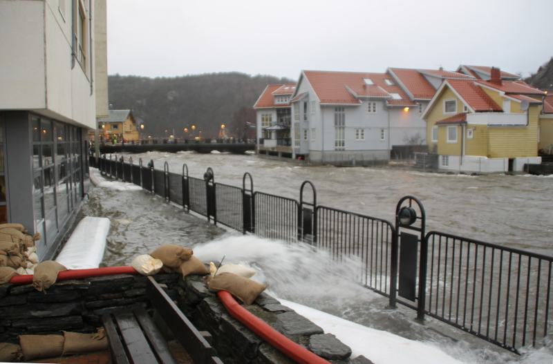
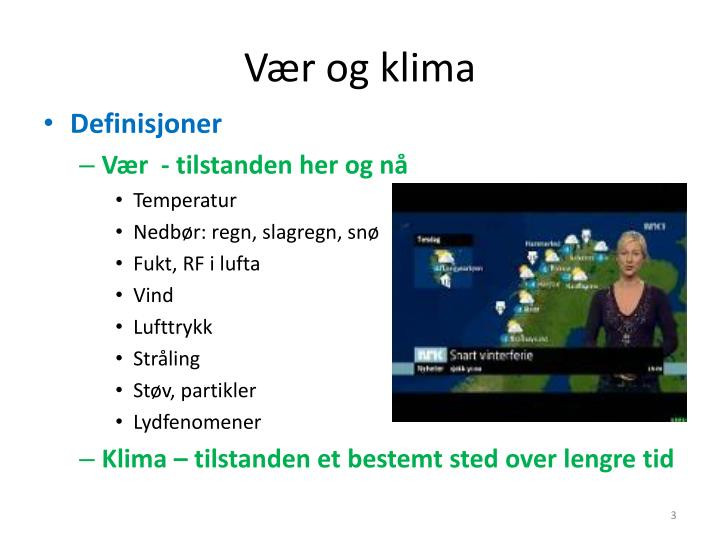
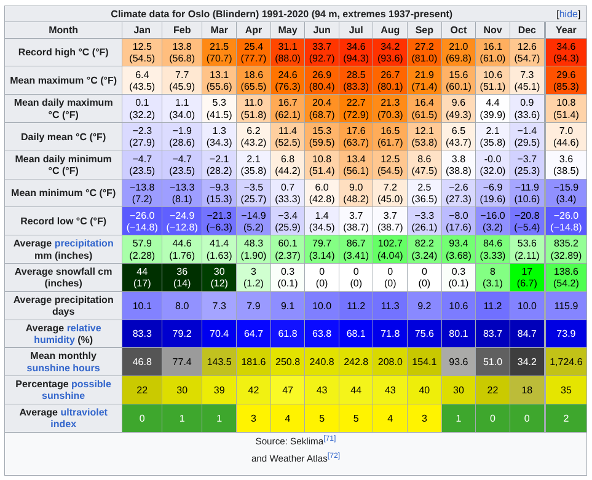

<figure>
    
    <figcaption>Ekstremværet Synne desember 2015 (© Semb Hadland/Eigersund kommune)</figcaption>
</figure>

## Bakgrunn

Global oppvarming fører noen steder til mer tørke, andre steder mer og kraftigere
nedbør, gjerne på én gang. I Norge har et våtere klima ført til en kraftig økning
i naturskader, med dertil høyere forsikringsutbetalinger og -premier.
Klimatilpasning er derfor et viktig satsingsområde hvor man på sikt kan spare
penger ved å begrense skader ved flom og ras.

Samtidig kan et varmere klima også gi mer tørke, og stille andre krav til hvilke
plantearter som passer i avlingene til bøndene. Klimaet i Sør-England er nå det
samme som i Champagne-regionen for hundre år siden, noe som har ført til et
oppsving i engelsk vinproduksjon. Kanskje kan vi dyrke vindruer i Norge om noen
generasjoner?

For de som ikke vet forskjellen på vær og klima, anbefaler vi [denne
presentasjonen](https://www.slideserve.com/rob/v-r-og-klima) fra en forelesning
i byggteknikk fra Høgskolen i Gjøvik.

## Funksjonelle krav

Appen skal formidle nyttig klimainformasjon om en eller flere naturhendelser av typen:

- flom fra vassdrag
- snøskred
- styrtregn
- kraftig vind
- bølger og springflo
- smelting av isbreer

Det er valgfritt om dere ønsker å dekke alle typer hendelser, eller velge noen
enkelte hvor dere går mer i dybden. **Uansett skal tidshorisonten være over
flere år, ikke bare de neste ukene.**

### Målgrupper

Målgrupper kan f.eks. være:

- boligbyggere som vil unngå flom- og rasutsatte tomter
- boligeiere som vil sjekke risiko for flom/ras og få råd om tiltak (drenering, fjellsikring, beplantning)
- kommunale etater som ønsker mer informasjon enn hva som finnes på varsom.no
- bønder som risikerer tap i avling pga tørke eller mye nedbør
- bønder eller hagedyrkere som ser etter nye arter som tåler fremtidens klima bedre
- de som vedlikeholder skiløyper og turstier, eller arrangerer slike turer

Appen bør komme med anbefalinger på klimatilpasning/andre tiltak for valgte målgrupper.

{: .note}
Merk at fokus i dette caset er på historiske data (klima). Det er ikke en app
for å sjekke været hvis man skal ut på tur!

### Kart

Appen bør vise på kart områder som er spesielt utsatt for naturskader.

Det bør være mulig å vise klimastatistikk (vind, nedbør, snømengde) for valgte
områder. Anbefaler bruk av aggregerte tidsserier fra meteorologiske målestasjoner i
nærheten, gjerne for hele Europa hvis dere greier å finne nok data. Slik gjør de
det på Wikipedia:

## Datakilder

### Klimadata (obligatorisk)

Begge versjoner av Frost har observasjonsdata, men aggregerte data (fx
middeltemperatur/mnd eller nedbør per døgn) er ikke kopiert inn i v1 ennå.
For disse bør man bruke v0 hvis man ikke finner de i v1.

- [Frost v0](https://frost.met.no/) - dagens versjon (under utfasing)
- [Frost v1](https://frost-rc.met.no/) - ny versjon i beta, lanseres til høsten

I tillegg anbefaler vi SeKlima for manuelt å finne data:

- [seklima.met.no](https://seklima.met.no/) - GUI, ikke API

Hvis man ønsker å utvide caset til hele Europa kan man finne aggregerte europeiske klimadata her:

- [EUMETNET Climate Observations](https://api.meteogate.eu/eu-eumetnet-climate-observations/v1)

Det utarbeides også rapporter for ekstremværhendelser med mye nyttig informasjon:

- [Ekstremvær-rapporter](https://www.met.no/publikasjoner/met-info/ekstremvaer) fra MET

### NVE

- [NVEs Kartkatalog](https://kartkatalog.nve.no/#wms) . har bl.a. flom- og skredkart i WMS-format
- [Bredata](https://www.nve.no/vann-og-vassdrag/vannets-kretsloep/bre/bredata/) som kart og nedlastbare data
- [NVE Sikringshåndbok](https://veiledere.nve.no/sikringshandboka/moduler/modul-f1-300-mulige-tiltak-mot-flom-og-oversvommelse/) - Mulige tiltak mot flom og oversvømmelse

NVE har også [flom-, flo- og snøskredfarevarsler](https://api.nve.no/doc/), men
det lite relevant for dette caset siden det er værvarsling og ikke klima.
