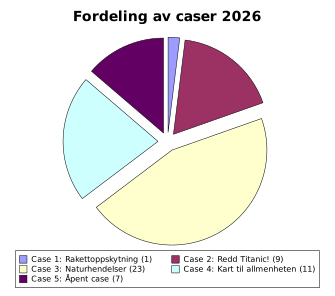

## Kursoversikt

- [Emneside for kurset](https://www.uio.no/studier/emner/matnat/ifi/IN2000/)
- [Semesterside for 2026](https://www.uio.no/studier/emner/matnat/ifi/IN2000/v26/)
- [Timeplan](https://tp.educloud.no/uio/app/schedule?semester=26v&scheduleType=course&filterOpen=false&summary=true&pastWeeks=false&tab=teaching&course=IN2000%C2%A41)
- [MET-prisen](./prisvinnere)

## Casebeskrivelser

- [Case 1. Rakettoppskyting](./1-rakett)
- [Case 2. Redd Titanic!](./2-titanic)
- [Case 3. Klimastatus](./3-klima)
- [Case 4. Kart til allmenheten](./4-kart)
- [Case 5. Åpent case](./5-open)

## MET-prisen

- [Vinnerne av årets MET-pris ble Team 17 med appen Paralax](./prisvinnere).

## Kontaktinfo

For spørsmål vedr METs tjenester, send en epost til en **(og kun én)** av følgende adresser alt
etter hva dere lurer på:

- api.met.no: <weatherapi-adm@met.no>
- PortalSpace: [Håkon Offernes](mailto:haakono@portalspace.no)
- Drifty: [Vegard Bønes](mailto:vegardb@met.no)
- frost.met.no: <observasjon@met.no>
- Victoria: <victoria@met.no>
- MCP-server: <mcp-server@met.no>
- Generelle spørsmål om casene: <geira@met.no>

{:.warning}
Ikke send epost til post@met.no, da havner det hos Arkivtjenesten i Miljødirektoratet
før saken havner på rundgang inntil den (kanskje) kommer til riktig instans.

Merk eposten med "IN2000" i subject-feltet så vi skjønner hva det er snakk om.
Ikke send epost til flere adresser samtidig, da ender vi opp med multiple saker i
forskjellige ticketsystemer, noe som genererer mye støy, kaos og ekstraarbeid.
