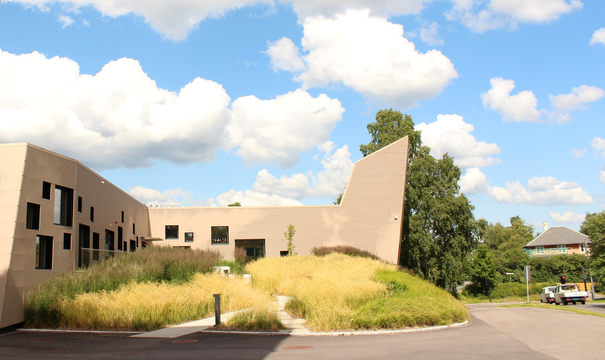

Hvert år siden starten i 2019 har vi utdelt MET-prisen for mest innovative bruk av våre data,
og i år er intet unntak. De [to](/2025/prisvinnere) [siste](/2024/vinnere) årene har prisen
gått til team som har valgt Rakettoppskyting-caset, blir det hat-trick i år?

Prisutdelingen avholdes **tirsdag 16. juni kl 14–16**, i METs kantine i [Tallhall på
Blinderen](https://www.openstreetmap.org/node/2788285561#map=18/59.942700/10.720658).
Arrangementet er åpent fysisk for de nominerte teamene, som får servert kaker og kaffe.
Møt gjerne opp noen minutter før så dere får satt dere ned før presentasjonene starter.

Øvrige studenter, MET-ansatte og evt andre interesserte kan følge prisutdelingen på Zoom:

<https://met-no.zoom.us/j/63943197899>

## Nominerte team

Følgende team er nominerte til å delta i konkurransen (casenr. står i parentes):

- Team  4 (4) Klart
- Team  8 (3) Blomster & Bier
- Team  9 (5) Spor AI
- Team 14 (3) Åkerblikk
- Team 16 (5) SoppSporer
- Team 17 (1) Paralax
- Team 18 (2) ArcticPath
- Team 20 (3) Geomerking
- Team 22 (2) Havblikk
- Team 48 (4) Klaring

Merk at for å kvalifisere til prisen må teamet ha fylt ut [nettskjema om bruk av
APIer](https://nettskjema.no/a/628460)!

### Informasjon til teamene

Når dere blir kalt opp og får koblet dere til projektor, skal dere først vise en
slide med flg info:

- teamnummer
- case
- navn/logo på appen
- navn på teammedlemmene

Dere får deretter 5 min til å demonstrere appen. Tiden starter når dere begynner
å snakke, så ikke bruk for mye tid på å si hva dere heter. Vi anbefaler sterkt å
vise live demo i stedet for ferdiglaget video. Det er EduRoam i lokalet.

Legg vekt på hva slags nytte den har for brukeren, og hva slags algoritmer
dere har brukt for å komme frem til resultatet (eks. beregning av innsparte
strømkostnader). Angi hvis dere har måttet gjøre noen antagelser eller
shortcuts.

Når tiden er ute skal dere til slutt vise en slide som viser hvilke APIer dere
har brukt, med vekt på de fra MET. Spesifiser hvilken variant og dataformat dere
har brukt (fx Locationforecast compact.json eller MetAlerts GeoJSON med
lat/lon-søk). Si gjerne kort om noen var spesielt lette/vanskelige å bruke og
hva dere synes manglet.

Prosjektrelaterte ting er uinteressante for MET, så ikke snakk om flg:

- ikke implementert funksjonalitet
- teamarbeid, prosjektstyring, kravspec
- MVVM, kobling/kohesjon, Kotlin, klassediagram, Use Case, GitHub

Etter hver presentasjon vil det bli en kort runde for spørsmål mens neste
team kommer fram til scenen.

Når alle presentasjoner er ferdige vil dommerne sette seg ned og kåre årets
MET-pris for mest kreativ bruk av våre data, som vil få en hyggelig premie.

Vel møtt i Tallhall!
