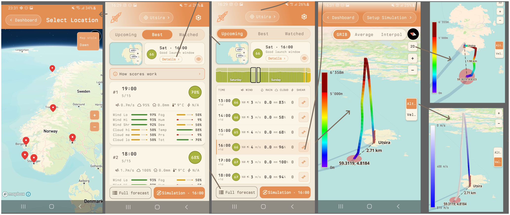

Hvert år siden starten i 2019 har vi utdelt MET-prisen for mest innovative bruk av våre data.
Av årets 51 team ble det nominert 10 team som fikk anledning til å presentere sine
apper for de ansatte på Meteorologisk institutt.

For tredje år på rad var det et team som hadde valgt rakettoppskytning som case
som vant MET-prisen, nemlig **Team 17** med appen *Paralax*. Disse fikk Yr-caps,
paraplyer og handlenett, samt et gavekort på 1000 kr.

På delt andreplass kom to team som begge hadde valgt case 3 (klima), nemlig
**Team 14** med appen *Åkerblikk* og **Team 20** med *Geomerking*. Disse fikk
caps og handlenett som trøstepremier.

Alle de andre nominerte teamene hadde også gjort imponerende arbeid, og det
var vanskelig å begrense seg til kun ti team totalt. De andre nominerte var:

- **Team  4** *Klart* (case 4) - værapp på mange språk, KI-generert værvarsel med språkmodell basert på Vidar Teisen
- **Team  8** *Blomster & Bier* (case 3) - finne beste hageplanter for fremtidens klima
- **Team  9** *Spor AI* (case 5) - MCP-basert turplanlegger med fotruter, skiløyper og sykkelruter
- **Team 16** *SoppSporer* (case 5) - finne steder for plukking av matsopp
- **Team 18** *ArcticPath* (case 2) - beregne rakettbaner basert på Interpol og GRIB
- **Team 22** *Havblikk* (case 2) - simulering av multiple isfjell langs skipsrute
- **Team 48** *Klaring* (case 4) - værkart både fra Yr-Maps og Victoria

MET takker alle deltagerne og gratulerer med flott innsats!
