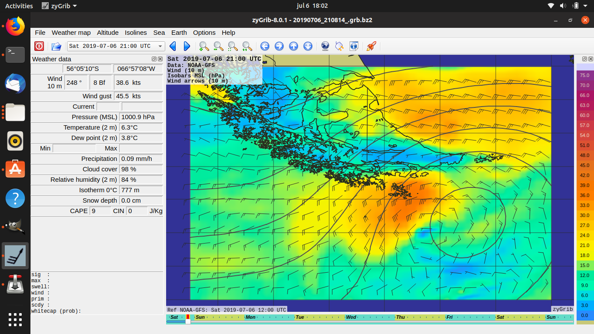

GRIB er et format for å laste ned rasterdata, som er mye brukt innen meteorologi.
APIet leverer GRIB-filer både for luftfart og for ferdsel til sjøs.

## GRIB-varsel for havområdene

### Gribfiles

MET produserer værvarsler for utvalgte kystområder som kan lastes ned i en enkelt fil.
Disse brukes av flere tusen fiskebåter og annen kysttrafikk for sikker navigasjon.

- [Gribfiles API](https://api.met.no/weatherapi/gribfiles/1.1/documentation)

Noen av disse filene kan være ganske store og være tunge å prosessere.
Dere trenger ikke å støtte alle områder langs kysten, men kan begrense til
f.eks. Oslofjord hvor filene er bare 150 KB.

## GRIB-varsel for luftfart

### IsobaricGRIB

- [Isobarcgrib API](https://api.met.no/weatherapi/isobaricgrib/1.0/documentation)

Dette er et produkt laget for Avinor, som bruker det til å styre lufttrafikken.
Her kan man laste ned filer i GRIB1- (Europa) og GRIB2-format (Sør-Norge), som
gir informasjon om vind og temperatur på forskjellige nivåer i atmosføren.
Det er hovedsaklig GRIB2 som er av interesse siden GRIB1-filene har svært lav oppløsning.

Filene er delt opp i flere lag med data. Hvert lag angir en trykkflate
fra 850 hPa (ca 1.5 km.o.h.) til 100 hPa. Hvert lag inneholder flg dataverdier:

- u (vind øst/vest)
- v (vind nord/sør)
- t (temperatur)

u og v følger her vanlig kartesisk koordinatsystem, dvs at positiv u blåser fra vest mot øst,
og positiv v fra sør til nord.

#### Beregning av vind

For å regne ut vindustyrke og -retning må man bruke vektorregning. Flg formler kan brukes:

    vindstyrke = sqrt(u^2 + v^2)
    retning = atan2(u, v)

Mer informasjon finnes her:

- [Veiledning til utregning av vind](http://colaweb.gmu.edu/dev/clim301/lectures/wind/wind-uv)
- [Introduksjon til vektorer](https://www.matematikk.net/side/Introduksjon_til_vektorer)
- [Vektorhefte for MAT1110](https://www.uio.no/studier/emner/matnat/math/MAT1110/v06/Vektorhefte.pdf).

#### Beregning av høyde

I filene angis ikke høyde i meter men i trykkflater (isobarer), siden flyenes
høydemåler baserer seg på trykk og man flyr langs trykkflater i stedet for
på fast høyde over havet. Trykket angis i hPa (hektopascal).

For å [regne ut](https://physics.stackexchange.com/questions/333475/how-to-calculate-altitude-from-current-temperature-and-pressure)
høyde over havet kan man bruke [den hydrostatiske
ligningen](https://en.wikipedia.org/wiki/Barometric_formula)
ut fra flg kjente variabler:

- trykk i høyden (GRIB)
- temperatur i høyden (GRIB)
- lufttrykk ved havnivå (locationforecast)
- (geopotensialet? kan ignoreres under 10 000 m.o.h.)

## Verktøy

### GRIB verktøy

Et enkelt verktøy for å visualisere GRIB-filer er [XyGrib](https://opengribs.org/en/xygrib).
Det er også mulig å bruke [QGIS](https://qgis.org/), men det er litt mer tungvint.

For å sjekke innhold i GRIB-filer anbefaler vi å bruke
[ecCodes](https://confluence.ecmwf.int/display/ECC/GRIB+tools).
Denne har flere nyttige kommandolinjeverktøy man kan bruke:

- `grib_ls` - vis lag og datapunkter
- `grib_get_data` - lister data for hvert punkt (*mye* output)
- `grib_dump -j` - vis alt av data som JSON (*enda mer* output)
- `grib_count` - sjekk antall datalag

Eksempel på JSON-output fra `grib_ls`:

```
$ grib_ls -j /medusa/modpro/isobaricgrib/T_YTNB85_C_ENMI_20240314060000.bin
{ "messages" : [
  {
    "edition": 2,
    "centre": "enmi",
    "date": 20240314,
    "dataType": "fc",
    "gridType": "regular_ll",
    "stepRange": 3,
    "typeOfLevel": "isobaricInhPa",
    "level": 850,
    "shortName": "v",
    "packingType": "grid_jpeg"
  },
  ...
```

For visualisering av GRIB-filer anbefaler vi også [XyGrib](https://opengribs.org/en/xygrib).
Merk at denne er laget primært for sjøfart og ikke greier å vise alle parametre
i høyden (fx vind). Den kan heller ikke parse GRIB1-filer fra IsobaricGRIB.

### Parsing av GRIB-filer

Det finnes en rekke [GRIB-parsere for Java](https://github.com/search?q=grib2+language%3AJava&type=repositories&l=Java)
som potensielt burde kunne brukes til å parse GRIB2. Dog leverer IsobaricGRIB
filer på ca 1.3 MB, som kanskje er tungvint å lese inn i i en mobilapp. I såfall
er det mulig å bruke en backend-server for lesing/parsing som leverer data til appen.

### Eksempel i Python

MET har laget et open source Python-basert API som laster ned IsobaricGRIB-filer
fra apiet og leverer en vertikalprofil som CoverageJSON for et gitt punkt.
Koden kan være nyttig å lese for å finne ut hvordan man skal tolke dataene.
Dersom dere bruker denne får dere også litt trening i å bruke [EDR](/edr):

- <https://github.com/metno/edrisobaric> - kildekode i Python

(Merk at denne kun laster ned GRIB-filer dersom de ikke allerede ligger på disk;
det er ingen automatisk oppdatering av disse.)
