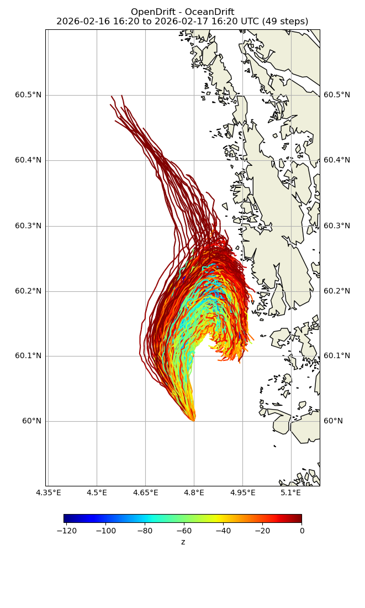
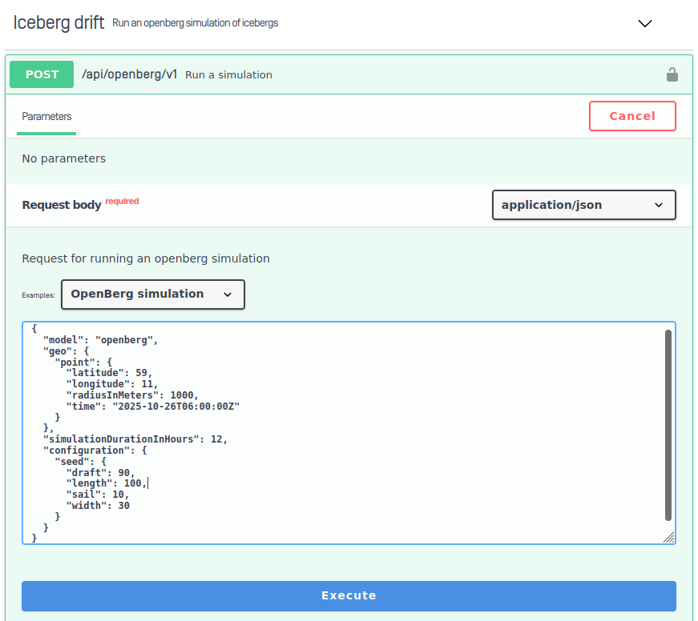

Drifty er en tjeneste fra MET for drivbanesimulering, som brukes bl.a. av
redningstjenester for å se hvordan ting i havet beveger seg. Eksempler:

- oljeutslipp
- personer som har falt i sjøen
- skip i havsnød
- isfjell

Modellen startes ved å sende en POST-request med input-data i JSON-format som body.

Outputformat er enten bilder eller NetCDF-filer. For sistnevnte må man i Kotlin bruke
Java-biblioteket [netcdf-java](https://www.unidata.ucar.edu/software/netcdf-java/) fra Unidata.

Tjenesten krever registrering. Når vi får tilsendt oversikt fra IFI over hvilke
team som har valgt caset vil dere få tilsendt brukernavn og passord.

## Datakilder:

- <https://in2000.drifty.met.no/> Drifty testserver
  - Autentisering med HTTP Basic Auth, de teamene som velger caset vil få tilsendt brukernavn og passord
  - Tilgjengelige objekt- og oljetyper kan finnes i <https://in2000.drifty.met.no/openapi.yaml>
- <https://opendrift.github.io/> - kildekode til OpenDrift (drivbanemodellen som brukes i Drifty)

## Eksempel:

- Kall: se [OpenDrift kildekode](https://opendrift.github.io/)
- Resultat: <https://in2000.drifty.met.no/api/simulation/ccaf8347-a819-438d-aa80-1ec57f6341a4/result> **(BROKEN)**

## Programvare

### For Kotlin/Java

- [netcdf-java](https://www.unidata.ucar.edu/software/netcdf-java/) fra Unidata.

### For debugging av NetCDF på PC:

- ncdump - linux kommandolinjeverktøy for å inspisere data/metadata
- [fimex](https://github.com/metno/fimex/wiki) - C-bibliotek og kommandolinjeverktøy for nedlasting og konvertering

Se <https://docs.api.met.no/doc/thredds> for eksempler
