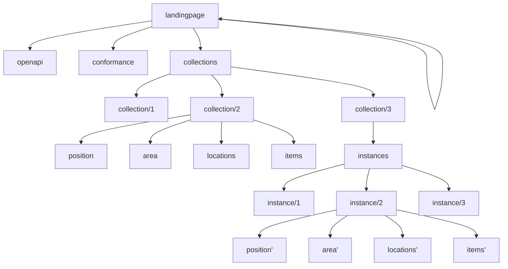

En nye standard som holder på å etablere seg innen geofag er **Environmental
Data Retrieval** fra [OGC](https://www.ogc.org/). Dette er en del av et sett av
tilhørende standarder kalt [OGC API](https://ogcapi.ogc.org/), hvorav EDR er
spesielt beregnet for søk i geodata. Som offentlig institutt er vi derfor pålagt
å implementere denne på bakgrunn av EUs
[INSPIRE-direktiv](https://knowledge-base.inspire.ec.europa.eu/legislation/inspire-directive_en).

## Standarder

- [Innføring i EDR](https://opengeospatial.github.io/e-learning/ogcapi-edr/text/basic-main.html)
- [EDR spesifikasjon](https://www.ogc.org/standard/ogcapi-edr/)

## Struktur

## Testverktøy

- UK Met Office sin [kartklient](https://labs.metoffice.gov.uk/edr/static/html/query.html)
