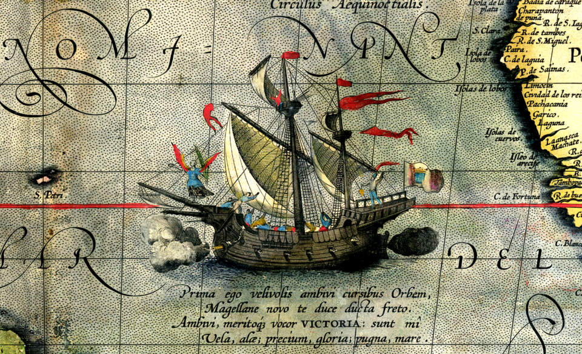

[Victoria](https://public-victoria.met.no/docs) er den nye WMS-baserte
offentlige karttjenesten fra MET, oppkalt etter det første
[skipet](https://en.wikipedia.org/wiki/Victoria_(ship)) som gjorde
jordomseiling.

Tjenesten er åpen uten registrering og kan finnes her:

- <https://public-victoria.met.no/docs>

## WMS

Victoria benytter [WMS-protokollen](./wms).
I WMS bruker man vanligvis to operasjoner, `GetCapabilities` og `GetMap`.

### GetCapabilities

Dette returnerer en liste med lag med tilhørende styles og gyldige kartprojeksjoner.
For å teste, legg inn flg verdier under "GET /wms":

|Parameter|Verdi|
|---------|-----|
|service  |WMS  |
|version  |1.3.0|
|request  |GetCapabilities|
|format   |image/png|
|transparent|true|
|group    |IN2000|

Eller bruk flg URL:

- <https://public-victoria.met.no/wms?service=WMS&version=1.3.0&request=GetCapabilities&format=image%2Fpng&transparent=true&group=IN2000>

Evt kan dere i stedet for `group` filtrere på `model`, flg kan være nyttige:

- meps_det_vdiv_2_5km_calculations
- arome_arctic_det_vdiv_2_5km_calculations
- ec_vdiv_1h

{: .note }
Vi anbefaler sterkt å filtrere på gruppe eller modell, da den komplette
Capabilities har 1979 lag og er på 7.6 MB som Swagger UI ikke greier å håndtere.
Komplett liste over modeller kan lastes ned på
[/get-models](https://public-victoria.met.no/get-models),
mens grupper (med tilhørende modeller) finnes på
[/get-model-groups](https://public-victoria.met.no/get-model-groups).

### GetMap

Denne returnerer et bilde med angitt dimensjon og innhold. Eksempel:

|Parameter|Verdi|
|---------|-----|
|service    |WMS|
|version    |1.3.0|
|request    |GetMap|
|layers     |Met_Norway_Ice_Chart|
|crs        |EPSG:3857|
|styles     |icechart|
|format     |image/png|
|transparent|TRUE|
|time       |2026-02-16T00:00:00Z|
|width      |3452|
|height     |1504|
|bbox       |-25144310.51397454,1908272.9190080315,17583880.838383913,20524495.33903906|

- <https://victoria.met.no/wms?REQUEST=GetMap&SERVICE=WMS&VERSION=1.3.0&FORMAT=image%2Fpng&STYLES=icechart&TRANSPARENT=TRUE&TIME=2026-02-16T00%3A00%3A00Z&LAYERS=Met_Norway_Ice_Chart&WIDTH=3452&HEIGHT=1504&CRS=EPSG%3A3857&BBOX=-25144310.51397454%2C1908272.9190080315%2C17583880.838383913%2C20524495.33903906>

Noen av disse parameterne (som `bbox`) greier typisk kartklienten selv å beregne,
mens andre må dere legge inn selv. Det inkluderer bl.a. flg:

- crs (kartprojeksjon)
- layers
- styles
- time

Alle disse verdiene finner dere listet i GetCapabilities. Under hvert layer
er det listet en rekke styles som kan brukes; hvis dere bruker en style som
tilhører et annet lag vil dere typisk få `500 Server Error`.

For `crs` anbefaler vi å bruke `EPSG:3857`, også kjent som WebMercator som er
det samme som brukes på Google Maps og OpenStreetMap.

Vi har laget et eksempel på hvordan bruke GetMap fra Victoria i MapLibre (velg
"view source" i browseren):

- [MapLibre eksempel](/assets/wms_test_victoria.html)

### Kartlag

Vi anbefaler å bruke flg layers:

#### Norden

|Layer|Title|
|-----|-----|
|air_temperature_2m_meps_det_vdiv_2_5km_calculations|Air temperature 2m in MEPS VDIV|
|precipitation_amount_1h_meps_det_vdiv_2_5km_calculations|Precipitation amount 1h in MEPS VDIV|
|wind_10m_vector_meps_det_vdiv_2_5km_calculations|Wind 10m vector in MEPS VDIV|

#### Arktis

|Layer|Title|
|-----|-----|
|air_temperature_2m_arome_arctic_det_vdiv_2_5km_calculations|Air temperature 2m in Arctic VDIV|
|precipitation_amount_1h_arome_arctic_det_vdiv_2_5km_calculations|Precipitation amount 1h in Arctic VDIV|
|wind_10m_vector_arome_arctic_det_vdiv_2_5km_calculations|Wind 10m vector in Arctic VDIV|

#### Global

|Layer|Title|
|-----|-----|
|air_temperature_2m_ec_vdiv_1h_calculations|Air temperature 2m in ECMWF 1 h|
|precipitation_amount_1h_ec_vdiv_1h_calculations|Precipitation amount 1h in ECMWF 1 h|
|wind_10m_vector_ec_vdiv_1h_calculations|Wind 10m vector in ECMWF 1 h|

Merk at listen over tilgjengelige layers endrer seg hele tiden, så hvis noe
plutselig slutter å virke må dere sjekke at laget fortsatt finnes i GetCapabilities.
